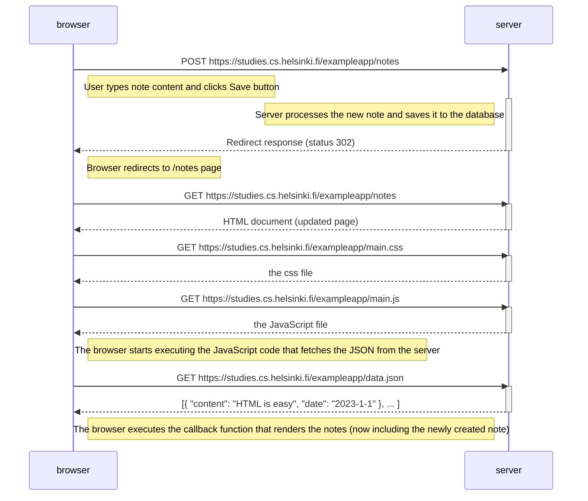

# 0.4: New note diagram

Diagram depicting the situation where the user creates a new note on the page https://studies.cs.helsinki.fi/exampleapp/notes by writing something into the text field and clicking the Save button.

## Key Points:
- The form submission triggers a traditional HTTP POST request
- The server saves the new note and responds with a redirect
- The browser automatically follows the redirect and loads the full page again
- All resources (HTML, CSS, JS) are fetched again
- The server returns the updated data.json with the new note included
