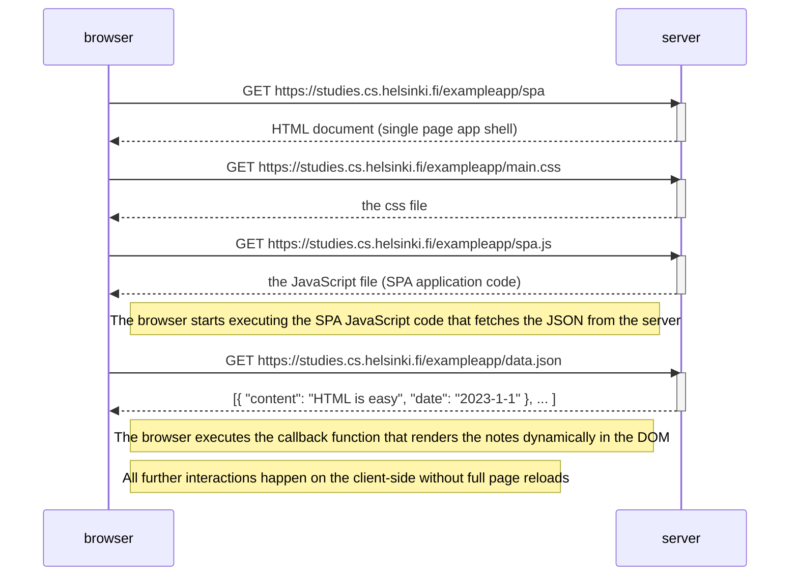

# 0.5: Single page app diagram

Diagram depicting the situation where the user goes to the single-page app version of the notes app at https://studies.cs.helsinki.fi/exampleapp/spa.

## Key Points:
- The initial request returns an HTML shell (minimal HTML structure)
- The SPA JavaScript code loads once and stays in memory
- All subsequent rendering is done by JavaScript in the browser
- No full page reloads occur when navigating within the app
- The page is called "single-page" because only one HTML page is served
- User interactions are handled entirely by client-side JavaScript
