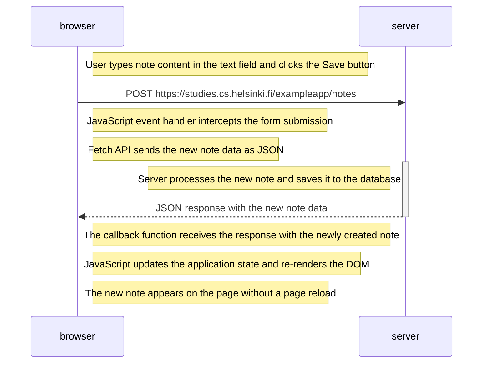

# 0.6: New note in Single page app diagram

Diagram depicting the situation where the user creates a new note using the single-page version of the app.

## Key Points:
- The form submission is handled by a JavaScript event handler (not a traditional form submission)
- Only a single POST request is sent to the server with the note data
- The response is in JSON format, not HTML
- No page reload occurs
- The DOM is updated dynamically by the JavaScript code
- The user experience is much faster compared to the traditional web app
- The server does not need to return a full HTML page
- Multiple notes can be created in rapid succession without any loading delays
